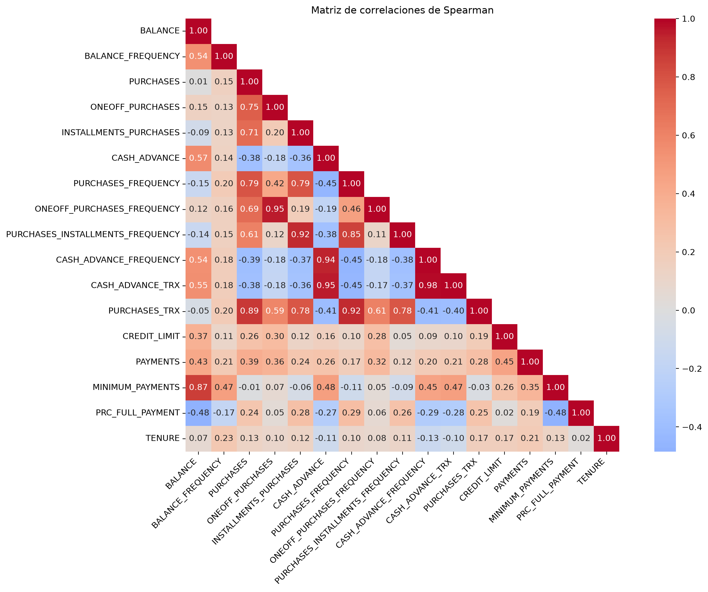
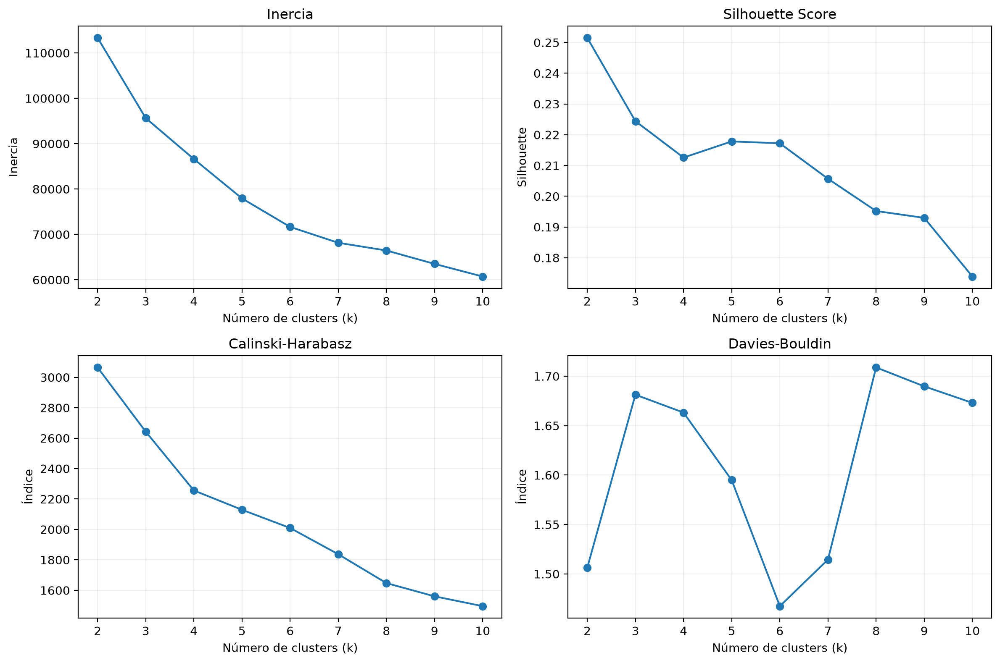
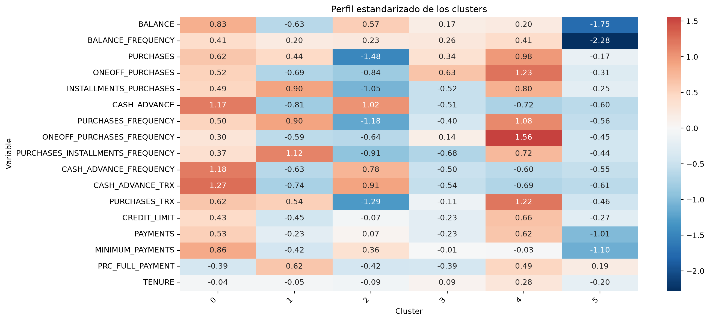
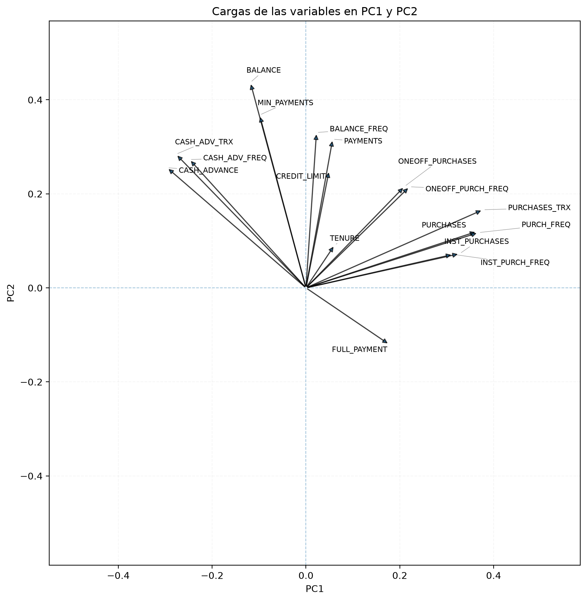
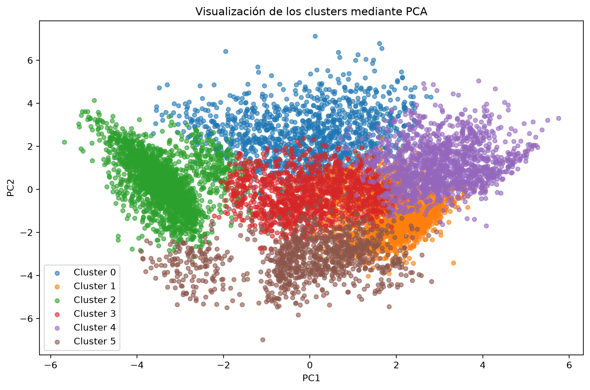

# Segmentación de clientes de tarjetas de crédito

Proyecto de Machine Learning no supervisado orientado a identificar distintos
perfiles de clientes a partir de sus patrones de uso de tarjetas de crédito.

El análisis comprende la exploración y preparación de los datos, el estudio de
su estructura para clustering, la construcción y evaluación de una segmentación
mediante K-Means, la caracterización de los segmentos obtenidos y el uso de
técnicas complementarias de visualización y clustering.

## Problema

La segmentación de clientes permite identificar grupos con comportamientos
similares y puede servir como apoyo para diseñar estrategias diferenciadas de
marketing, comunicación y gestión de clientes.

En este proyecto se analizan variables relacionadas con saldo, compras,
adelantos de efectivo, pagos, límites de crédito y frecuencia de uso, con el
objetivo de encontrar patrones de comportamiento sin disponer previamente de
una variable objetivo o etiquetas de segmento.

## Datos

El conjunto de datos contiene información sobre aproximadamente 9.000 titulares
activos de tarjetas de crédito durante un período de seis meses.

Cada fila representa un cliente y la base original contiene **8.950
observaciones y 18 variables de comportamiento e identificación**.

**Fuente:** [Credit Card Dataset](https://www.kaggle.com/datasets/arjunbhasin2013/ccdata)

Las descripciones siguientes corresponden a una traducción y adaptación del
diccionario proporcionado por la fuente original.

### Diccionario de variables

| Variable | Descripción |
|---|---|
| `CUST_ID` | Identificador del titular de la tarjeta de crédito. |
| `BALANCE` | Saldo disponible o mantenido en la cuenta para realizar compras. |
| `BALANCE_FREQUENCY` | Frecuencia con la que se actualiza el saldo, entre 0 y 1. |
| `PURCHASES` | Monto total de compras realizadas. |
| `ONEOFF_PURCHASES` | Monto máximo de compra realizado en una sola operación. |
| `INSTALLMENTS_PURCHASES` | Monto de compras realizadas en cuotas. |
| `CASH_ADVANCE` | Monto obtenido mediante adelantos de efectivo. |
| `PURCHASES_FREQUENCY` | Frecuencia con la que se realizan compras, entre 0 y 1. |
| `ONEOFF_PURCHASES_FREQUENCY` | Frecuencia de compras realizadas en una sola operación. |
| `PURCHASES_INSTALLMENTS_FREQUENCY` | Frecuencia de compras realizadas en cuotas. |
| `CASH_ADVANCE_FREQUENCY` | Frecuencia de utilización de adelantos de efectivo. |
| `CASH_ADVANCE_TRX` | Número de transacciones de adelanto de efectivo. |
| `PURCHASES_TRX` | Número de transacciones de compra realizadas. |
| `CREDIT_LIMIT` | Límite de crédito de la tarjeta. |
| `PAYMENTS` | Monto total de pagos realizados por el cliente. |
| `MINIMUM_PAYMENTS` | Monto mínimo de pagos realizados. |
| `PRC_FULL_PAYMENT` | Proporción de pagos realizados por el monto completo. |
| `TENURE` | Antigüedad observada del servicio de tarjeta, expresada en meses. |

## Flujo del proyecto

El proyecto se divide en dos etapas principales:

1. **Preparación y análisis exploratorio**
   - inspección y calidad de los datos;
   - tratamiento de valores faltantes;
   - análisis de distribuciones, asimetrías y valores extremos;
   - análisis de relaciones entre variables;
   - generación de la base procesada.

2. **Modelado y segmentación**
   - transformaciones para métodos basados en distancias;
   - estandarización;
   - evaluación de tendencia al agrupamiento;
   - selección y validación del número de clusters;
   - K-Means y perfilamiento de segmentos;
   - PCA para visualización;
   - comparación exploratoria con DBSCAN.

## Preparación y análisis exploratorio

La exploración inicial confirmó **8.950 clientes y 18 variables**. La mayoría
de las características son numéricas, mientras que `CUST_ID` funciona
únicamente como identificador y no aporta información de comportamiento para
el clustering.

### Calidad de los datos

Se revisaron valores faltantes y registros duplicados.

Se detectó que dos variables tienen valores nulos:

| Variable | Valores nulos | Porcentaje |
|---|---:|---:|
| `CREDIT_LIMIT` | 1 | 0.01% |
| `MINIMUM_PAYMENTS` | 313 | 3.50% |

`CREDIT_LIMIT` representa el límite de crédito asignado al cliente, mientras que
`MINIMUM_PAYMENTS` corresponde al monto asociado a pagos mínimos.

Dado el contexto se planea imputar, y antes de hacerlo se compara la media y la mediana de
ambas variables:

| Variable | Media | Mediana |
|---|---:|---:|
| `CREDIT_LIMIT` | 4494.45 | 3000.00 |
| `MINIMUM_PAYMENTS` | 864.21 | 312.34 |

En ambos casos la media supera la mediana lo que sugiere que las
distribuciones pueden estar influenciadas por valores elevados, por ello se imputa con la **mediana** ya que resulta menos sensible a valores extremos que la media.

`CUST_ID` se eliminó antes del modelado porque funciona únicamente como
identificador del cliente.

Después de estas decisiones, la base procesada conserva **8.950 clientes y
17 variables de comportamiento**.

### Distribución de las variables

|                                  |   count |    mean |     std |   min |     25% |     50% |     75% |     max |
|:---------------------------------|--------:|--------:|--------:|------:|--------:|--------:|--------:|--------:|
| BALANCE                          |    8950 | 1564.47 | 2081.53 |  0    |  128.28 |  873.39 | 2054.14 | 19043.1 |
| BALANCE_FREQUENCY                |    8950 |    0.88 |    0.24 |  0    |    0.89 |    1    |    1    |     1   |
| PURCHASES                        |    8950 | 1003.2  | 2136.63 |  0    |   39.64 |  361.28 | 1110.13 | 49039.6 |
| ONEOFF_PURCHASES                 |    8950 |  592.44 | 1659.89 |  0    |    0    |   38    |  577.4  | 40761.2 |
| INSTALLMENTS_PURCHASES           |    8950 |  411.07 |  904.34 |  0    |    0    |   89    |  468.64 | 22500   |
| CASH_ADVANCE                     |    8950 |  978.87 | 2097.16 |  0    |    0    |    0    | 1113.82 | 47137.2 |
| PURCHASES_FREQUENCY              |    8950 |    0.49 |    0.4  |  0    |    0.08 |    0.5  |    0.92 |     1   |
| ONEOFF_PURCHASES_FREQUENCY       |    8950 |    0.2  |    0.3  |  0    |    0    |    0.08 |    0.3  |     1   |
| PURCHASES_INSTALLMENTS_FREQUENCY |    8950 |    0.36 |    0.4  |  0    |    0    |    0.17 |    0.75 |     1   |
| CASH_ADVANCE_FREQUENCY           |    8950 |    0.14 |    0.2  |  0    |    0    |    0    |    0.22 |     1.5 |
| CASH_ADVANCE_TRX                 |    8950 |    3.25 |    6.82 |  0    |    0    |    0    |    4    |   123   |
| PURCHASES_TRX                    |    8950 |   14.71 |   24.86 |  0    |    1    |    7    |   17    |   358   |
| CREDIT_LIMIT                     |    8950 | 4494.28 | 3638.65 | 50    | 1600    | 3000    | 6500    | 30000   |
| PAYMENTS                         |    8950 | 1733.14 | 2895.06 |  0    |  383.28 |  856.9  | 1901.13 | 50721.5 |
| MINIMUM_PAYMENTS                 |    8950 |  844.91 | 2332.79 |  0.02 |  170.86 |  312.34 |  788.71 | 76406.2 |
| PRC_FULL_PAYMENT                 |    8950 |    0.15 |    0.29 |  0    |    0    |    0    |    0.14 |     1   |
| TENURE                           |    8950 |   11.52 |    1.34 |  6    |   12    |   12    |   12    |    12   |

Las variables presentan comportamientos considerablemente diferentes según
su naturaleza. Los montos y conteos muestran, en varios casos, una fuerte
concentración en valores bajos junto con colas derechas pronunciadas,
especialmente en compras, adelantos de efectivo y pagos.

### Análisis de asimetría

El coeficiente de asimetría confirma lo observado previamente en las
distribuciones: varias variables presentan colas pronunciadas,
especialmente aquellas asociadas a montos y actividad transaccional.

|                                  |       |
|:---------------------------------|------:|
| MINIMUM_PAYMENTS                 | 13.85 |
| ONEOFF_PURCHASES                 | 10.05 |
| PURCHASES                        |  8.14 |
| INSTALLMENTS_PURCHASES           |  7.3  |
| PAYMENTS                         |  5.91 |
| CASH_ADVANCE_TRX                 |  5.72 |
| CASH_ADVANCE                     |  5.17 |
| PURCHASES_TRX                    |  4.63 |
| BALANCE                          |  2.39 |
| PRC_FULL_PAYMENT                 |  1.94 |
| CASH_ADVANCE_FREQUENCY           |  1.83 |
| ONEOFF_PURCHASES_FREQUENCY       |  1.54 |
| CREDIT_LIMIT                     |  1.52 |
| PURCHASES_INSTALLMENTS_FREQUENCY |  0.51 |
| PURCHASES_FREQUENCY              |  0.06 |
| BALANCE_FREQUENCY                | -2.02 |
| TENURE                           | -2.94 |

### Boxplot de variables

Se muestran que para la mayoría de variables se tienen numerosos valores extremos, especialmente en variables monetarias y transaccionales. En este contexto pueden representar comportamientos legítimos de clientes —por ejemplo,
clientes con montos de compra, saldo o adelantos particularmente elevados— por lo que no se asume necesariamente errores de registro.

Su influencia sobre los métodos basados en distancias se aborda posteriormente mediante transformaciones y estandarización.

### Relaciones entre variables

Dado que varias variables presentan distribuciones asimétricas y valores
extremos, se utilizó la **correlación de Spearman** que evalúa relaciones monotónicas a partir de los rangos de las observaciones y es menos sensible a valores extremos.

Las asociaciones más altas aparecen entre variables que representan distintas
facetas de un mismo comportamiento. Por ejemplo, `CASH_ADVANCE`,
`CASH_ADVANCE_FREQUENCY` y `CASH_ADVANCE_TRX` están fuertemente relacionadas,
lo que es coherente con que describan respectivamente el monto, la frecuencia
y el número de operaciones de adelanto de efectivo. De forma similar,
`PURCHASES`, `PURCHASES_FREQUENCY` y `PURCHASES_TRX`, así como las variables
asociadas a compras en cuotas, muestran relaciones elevadas.

Esto sugiere que parte de la información se concentra en grupos de variables
que describen dimensiones de comportamiento comunes. Más adelante, PCA se
utiliza para resumir esa estructura multivariada y facilitar su visualización.

## Preparación de los datos para clustering

Antes de aplicar K-Means se prepararon las variables para reducir el efecto de
las distribuciones muy asimétricas y de las diferencias de escala.

Se aplicó una transformación `log1p` a las variables de monto y conteo con
asimetría positiva marcada:

- `BALANCE`
- `PURCHASES`
- `ONEOFF_PURCHASES`
- `INSTALLMENTS_PURCHASES`
- `CASH_ADVANCE`
- `CASH_ADVANCE_TRX`
- `PURCHASES_TRX`
- `CREDIT_LIMIT`
- `PAYMENTS`
- `MINIMUM_PAYMENTS`

Las variables de frecuencia, proporción y `TENURE` se mantuvieron en su escala
original.

Posteriormente, todas las variables se estandarizaron mediante `StandardScaler`.
Este paso es necesario porque K-Means utiliza distancias y variables con escalas
mayores podrían dominar la formación de los clusters.

El modelo se ajusta sobre los datos transformados y estandarizados, mientras que
los valores originales se conservan para interpretar posteriormente los
segmentos.

## Tendencia a formar clusters

Antes de aplicar K-Means se evaluó si los datos presentan una estructura
agrupable mediante la **estadística de Hopkins**.

En esta implementación, valores cercanos a 0.5 sugieren una distribución
aproximadamente aleatoria, mientras que valores próximos a 1 indican una mayor
tendencia a formar agrupaciones.

El cálculo se repitió 20 veces para comprobar la estabilidad del resultado,
obteniéndose un Hopkins promedio de **0.863**, con una desviación estándar de
**0.002** y valores entre **0.859 y 0.868**.

La consistencia de estos resultados y su distancia respecto de 0.5 indican una
fuerte tendencia al agrupamiento, por lo que resulta razonable continuar con
métodos de clustering.

## Selección del número de clusters

Se evaluaron soluciones entre `k = 2` y `k = 10` mediante cuatro criterios
complementarios:

- **Inercia:** mide la dispersión interna de los clusters; disminuye siempre al
  aumentar `k`, por lo que se busca un punto de inflexión.
- **Silhouette Score:** combina cohesión interna y separación entre clusters;
  valores mayores indican una mejor partición.
- **Calinski-Harabasz:** compara separación entre grupos con dispersión interna;
  valores mayores son preferibles.
- **Davies-Bouldin:** evalúa la similitud entre clusters; valores menores indican
  grupos más compactos y diferenciados.

Los criterios no identifican una única solución dominante. `k = 2` presenta el
mayor Silhouette Score y el mayor índice Calinski-Harabasz, mientras que
`k = 6` obtiene el menor Davies-Bouldin. Las soluciones de 5 y 6 clusters
mantienen además valores de Silhouette similares.

Por ello, se consideraron `k = 2`, `k = 5` y `k = 6` como soluciones candidatas
para un análisis adicional de estabilidad e interpretabilidad.

## Estabilidad de las soluciones

Como K-Means depende de la inicialización de los centroides, se evaluó la
estabilidad de las soluciones candidatas mediante el **Adjusted Rand Index
(ARI)**.

ARI mide cuánto coinciden dos particiones del mismo conjunto de datos,
independientemente del número asignado a cada etiqueta. Valores próximos a 1
indican que distintas inicializaciones producen prácticamente la misma
segmentación.

Las soluciones candidatas se ajustaron con 20 semillas distintas. `k = 2`
resultó prácticamente invariable, con un ARI medio de **0.999**. Entre las
soluciones más detalladas, `k = 6` mostró una estabilidad media de **0.904**,
superior a `k = 5`, que alcanzó **0.878**.

## Selección de número de cluster óptimo

Aunque `k = 2` presenta la mayor estabilidad y una buena separación geométrica,
produce una segmentación demasiado general para el objetivo de caracterizar
distintos comportamientos de clientes.

Entre las alternativas más detalladas, `k = 6` ofrece un mejor equilibrio entre
estabilidad, separación e interpretabilidad que `k = 5`. Por ello se seleccionó
como número óptimo de **6 clusters**.

| Cluster | Proporción de clientes |
|---:|---:|
| 0 | 13.91% |
| 1 | 18.60% |
| 2 | 24.50% |
| 3 | 15.44% |
| 4 | 16.27% |
| 5 | 11.27% |

## Perfilamiento de los segmentos

Una vez definida la solución de seis clusters, se analizaron sus características
para traducir las agrupaciones obtenidas por K-Means en perfiles de clientes
interpretables.

Se utilizaron dos perspectivas complementarias:

- **Medianas en escala original:** permiten describir al cliente típico de cada
  segmento en las unidades originales de las variables y son robustas frente a
  los valores extremos observados en varias distribuciones.

|                                  |       0 |       1 |       2 |       3 |       4 |       5 |
|:---------------------------------|--------:|--------:|--------:|--------:|--------:|--------:|
| BALANCE                          | 2705.15 |  100.42 | 1595.98 |  907.68 |  762.29 |   13.36 |
| BALANCE_FREQUENCY                |    1    |    1    |    1    |    1    |    1    |    0.33 |
| PURCHASES                        |  830.15 |  480.27 |    0    |  409.97 | 2339.06 |  133    |
| ONEOFF_PURCHASES                 |  374.95 |    0    |    0    |  329.33 | 1373.92 |    0    |
| INSTALLMENTS_PURCHASES           |  310.64 |  449.28 |    0    |    0    |  692.78 |   25.58 |
| CASH_ADVANCE                     | 1984.01 |    0    | 1372.81 |    0    |    0    |    0    |
| PURCHASES_FREQUENCY              |    0.75 |    0.92 |    0    |    0.3  |    1    |    0.17 |
| ONEOFF_PURCHASES_FREQUENCY       |    0.2  |    0    |    0    |    0.17 |    0.67 |    0    |
| PURCHASES_INSTALLMENTS_FREQUENCY |    0.5  |    0.88 |    0    |    0    |    0.75 |    0.08 |
| CASH_ADVANCE_FREQUENCY           |    0.33 |    0    |    0.25 |    0    |    0    |    0    |
| CASH_ADVANCE_TRX                 |    7    |    0    |    4    |    0    |    0    |    0    |
| PURCHASES_TRX                    |   13    |   12    |    0    |    5    |   32    |    3    |
| CREDIT_LIMIT                     | 5000    | 2000    | 3000    | 2500    | 6000    | 2700    |
| PAYMENTS                         | 1734.24 |  547.61 |  810.48 |  590.39 | 2031.25 |  270.73 |
| MINIMUM_PAYMENTS                 | 1030.27 |  171.01 |  518.48 |  312.34 |  244.96 |  114.01 |
| PRC_FULL_PAYMENT                 |    0    |    0.18 |    0    |    0    |    0.08 |    0    |
| TENURE                           |   12    |   12    |   12    |   12    |   12    |   12    |

- **Medias estandarizadas:** permiten identificar qué características se
  encuentran relativamente por encima o por debajo del comportamiento general
  de los clientes en el mismo espacio utilizado por K-Means.

### Segmentos identificados

Considerando conjuntamente las medianas en escala original y el perfil
estandarizado, los seis segmentos pueden caracterizarse de la siguiente forma:

- **Cluster 0 — Uso intensivo de adelantos:** clientes con saldos elevados y
  fuerte utilización de adelantos de efectivo, tanto en monto como en frecuencia
  y número de operaciones. También mantienen actividad de compra relevante.

- **Cluster 1 — Compradores frecuentes a cuotas:** destacan por su frecuencia
  de compra y el uso de compras en cuotas, con escasa utilización de adelantos
  de efectivo y saldos relativamente bajos.

- **Cluster 2 — Usuarios orientados a adelantos:** presentan muy poca actividad
  de compra y concentran principalmente su utilización de la tarjeta en
  adelantos de efectivo.

- **Cluster 3 — Compradores ocasionales:** muestran una actividad de compra
  moderada, principalmente mediante compras puntuales, con menor frecuencia y
  poco uso de adelantos.

- **Cluster 4 — Compradores intensivos:** concentran los niveles más elevados de
  compras, transacciones y frecuencia de utilización, junto con límites de
  crédito relativamente altos y poco uso de adelantos.

- **Cluster 5 — Clientes de baja actividad:** presentan bajos saldos, menor
  frecuencia de uso, pagos reducidos y poca actividad transaccional.

## Visualización e interpretación mediante PCA

PCA se utilizó como herramienta de **reducción de dimensionalidad para
visualización**, no para volver a entrenar K-Means.

El modelo de clustering fue ajustado utilizando las 17 variables preparadas.
Sin embargo, ese espacio no puede representarse gráficamente de forma directa.
Por ello, PCA proyecta la información sobre dos componentes principales,
permitiendo visualizar a los clientes y sus clusters en un plano bidimensional.

### Varianza explicada

- PC1 = 33.9%
- PC2 = 22.0%
- Acumulada = 55.8%

Las dos primeras componentes explican conjuntamente el **55.8% de la
variabilidad total**: PC1 explica un **33.9%** y PC2 un **22.0%**.

Se utilizan dos componentes porque permiten una representación gráfica
bidimensional fácilmente interpretable.

El 55.8% de varianza acumulada indica que una parte importante de la estructura
puede visualizarse en este plano, pero también confirma que el comportamiento
de los clientes es **multidimensional**. De hecho, 6 componentes explican
aproximadamente el **84.2%** y 8 componentes el **91.5%** de la variabilidad.

### Interpretación de las componentes

Las cargas de PCA muestran cuánto contribuye cada variable a cada componente y
en qué dirección. Variables orientadas en direcciones similares representan
patrones relacionados, mientras que direcciones opuestas reflejan
comportamientos contrapuestos.

| Variable | PC1 | PC2 |
|---|---:|---:|
| `BALANCE` | -0.119 | 0.437 |
| `BALANCE_FREQUENCY` | 0.022 | 0.330 |
| `PURCHASES` | 0.364 | 0.120 |
| `ONEOFF_PURCHASES` | 0.210 | 0.216 |
| `INSTALLMENTS_PURCHASES` | 0.328 | 0.073 |
| `CASH_ADVANCE` | -0.296 | 0.256 |
| `PURCHASES_FREQUENCY` | 0.368 | 0.118 |
| `ONEOFF_PURCHASES_FREQUENCY` | 0.221 | 0.215 |
| `PURCHASES_INSTALLMENTS_FREQUENCY` | 0.314 | 0.071 |
| `CASH_ADVANCE_FREQUENCY` | -0.248 | 0.273 |
| `CASH_ADVANCE_TRX` | -0.277 | 0.284 |
| `PURCHASES_TRX` | 0.377 | 0.166 |
| `CREDIT_LIMIT` | 0.049 | 0.250 |
| `PAYMENTS` | 0.057 | 0.316 |
| `MINIMUM_PAYMENTS` | -0.099 | 0.368 |
| `PRC_FULL_PAYMENT` | 0.178 | -0.120 |
| `TENURE` | 0.061 | 0.091 |

PC1 está principalmente asociado a la **actividad de compra**. Variables como
`PURCHASES_TRX`, `PURCHASES_FREQUENCY`, `PURCHASES` y las compras en cuotas
presentan cargas positivas elevadas, mientras que `CASH_ADVANCE`,
`CASH_ADVANCE_TRX` y `CASH_ADVANCE_FREQUENCY` aparecen en dirección negativa.

PC2 está determinado principalmente por `BALANCE`, `MINIMUM_PAYMENTS`,
`BALANCE_FREQUENCY`, `PAYMENTS`, además del límite de crédito y las variables de
adelantos. Puede interpretarse como una dimensión relacionada con el **nivel de
saldo y utilización financiera de la tarjeta**.

### Proyección de los segmentos

Una vez interpretados los dos ejes principales, los clientes pueden proyectarse
sobre PC1 y PC2 para observar cómo se distribuyen los seis segmentos en una
representación bidimensional.

La proyección muestra diferencias visibles entre varios segmentos. Los clusters
relacionados con adelantos de efectivo tienden a desplazarse hacia valores
negativos de PC1, mientras que los segmentos con mayor actividad de compra se
concentran hacia valores positivos.

También existe superposición entre grupos, lo que no implica necesariamente una
mala segmentación: K-Means fue ajustado utilizando las 17 variables, mientras
que esta figura conserva únicamente el 55.8% de la variabilidad total.

## Comparación con DBSCAN

Como contraste con K-Means, se evaluó **DBSCAN**, un algoritmo de clustering
basado en densidad.

A diferencia de K-Means, DBSCAN no requiere definir previamente el número de
clusters. En su lugar, identifica regiones donde las observaciones se encuentran
suficientemente concentradas y puede clasificar como **ruido** aquellas que no
pertenecen a ninguna región densa.

Su incorporación permite evaluar si los clientes presentan una estructura de
agrupamiento basada en densidad y no únicamente una partición alrededor de
centroides.

DBSCAN depende principalmente de dos parámetros:

- `min_samples`: número mínimo de observaciones requerido para considerar una
  región suficientemente densa.
- `eps`: distancia máxima utilizada para definir el vecindario de cada
  observación.

Dado que el conjunto de modelado contiene 17 variables, se consideraron valores
de `min_samples` relacionados con la dimensionalidad (`18` y `34`), en lugar de
utilizar un valor pequeño de forma arbitraria.

Para cada alternativa se calcularon las distancias al vecino correspondiente y
se utilizaron distintos cuantiles de dichas distancias como valores candidatos
de `eps`.

Los resultados de sensibilidad fueron:

| `min_samples` | `eps` | Clusters | Ruido |
|---:|---:|---:|---:|
| 18 | 2.352 | 2 | 2.96% |
| 18 | 2.515 | 1 | 1.79% |
| 18 | 2.724 | 1 | 1.02% |
| 18 | 3.033 | 1 | 0.36% |
| 18 | 3.455 | 1 | 0.03% |
| 34 | 2.636 | 1 | 2.51% |
| 34 | 2.816 | 2 | 1.54% |
| 34 | 3.060 | 1 | 0.73% |
| 34 | 3.421 | 1 | 0.11% |
| 34 | 3.851 | 1 | 0.03% |

La mayoría de las configuraciones produce un único cluster. Las únicas
alternativas que generan más de un grupo fueron analizadas con mayor detalle:

| `min_samples` | `eps` | Cluster principal | Segundo cluster | Ruido | Silhouette* |
|---:|---:|---:|---:|---:|---:|
| 18 | 2.352 | 96.87% | 0.18% | 2.95% | 0.175 |
| 34 | 2.816 | 98.29% | 0.17% | 1.54% | 0.132 |

\*Silhouette calculado excluyendo las observaciones clasificadas como ruido.

En ambas configuraciones, prácticamente todos los clientes quedan concentrados
en una única región densa, mientras que el segundo cluster contiene menos del
0.2% de la muestra.

Además, pequeñas modificaciones de `eps` hacen que los grupos se fusionen
rápidamente en un solo cluster, lo que indica que la estructura de densidad no
presenta separaciones suficientemente claras.

Por tanto, DBSCAN no genera en este caso segmentos de clientes suficientemente
representativos ni estables para el objetivo del análisis. Su resultado sugiere
que, en el espacio multivariado utilizado, los clientes forman principalmente
una región densa continua acompañada de algunas observaciones periféricas.

En comparación, K-Means proporciona una partición más útil para caracterizar
distintos perfiles de comportamiento de los clientes.

## Conclusión

El análisis permitió identificar una estructura de segmentación interpretable a
partir del comportamiento de uso de las tarjetas de crédito.

La combinación de preparación de datos, evaluación de estabilidad y perfilamiento
permitió obtener seis segmentos con patrones diferenciados de compra, adelantos
de efectivo, pagos y nivel de actividad.

K-Means resultó más adecuado para este objetivo que DBSCAN, mientras que PCA
permitió resumir y visualizar parte de la estructura multivariada encontrada.

En conjunto, los resultados muestran cómo técnicas de clustering pueden
transformar información transaccional en perfiles útiles para apoyar decisiones
de segmentación y análisis de clientes.