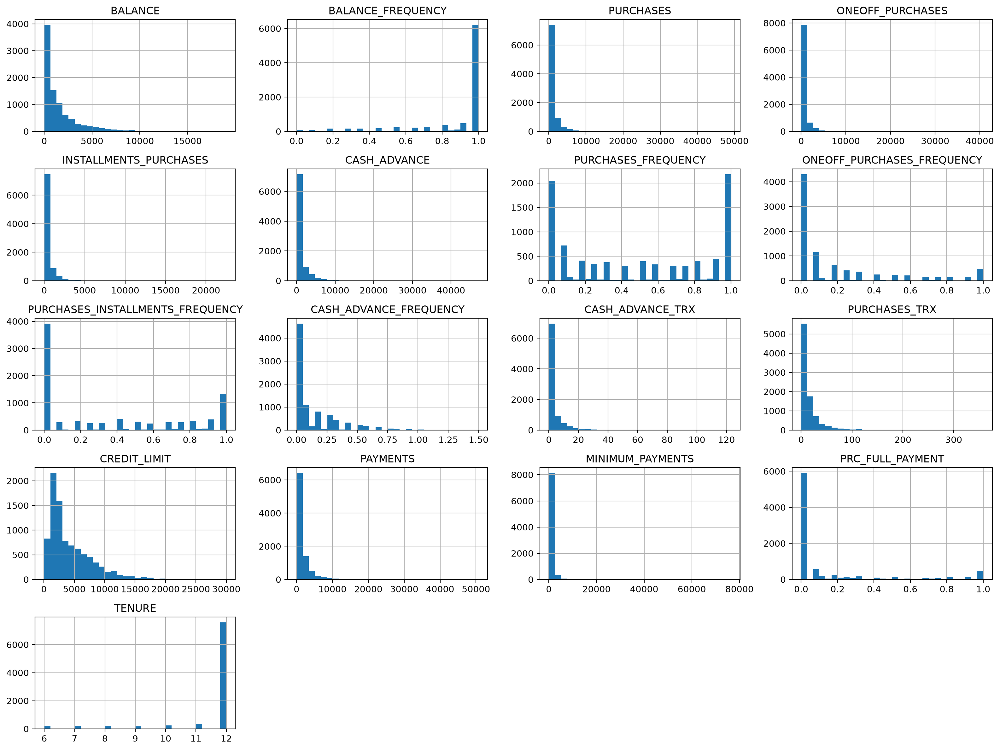
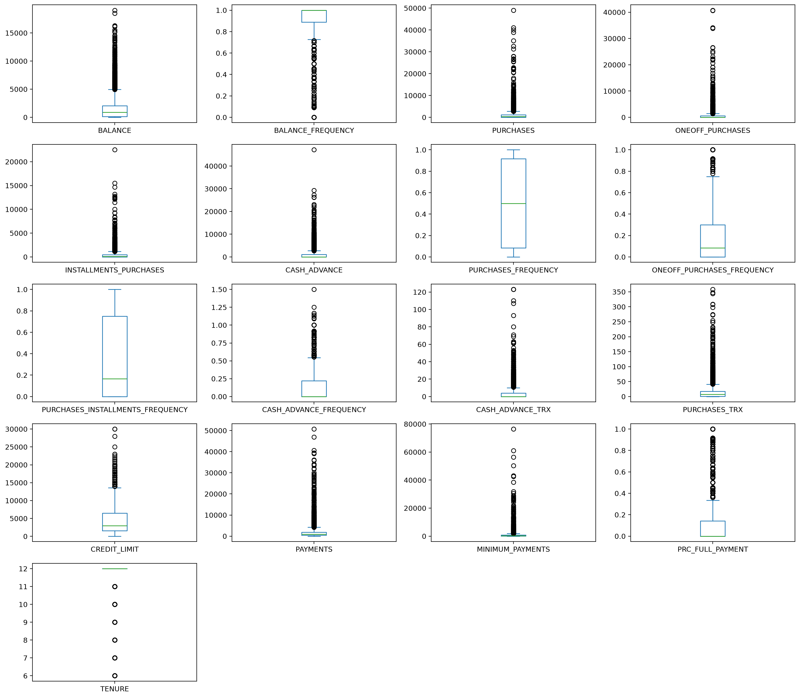

# Segmentación de clientes de tarjetas de crédito

Proyecto de Machine Learning no supervisado orientado a identificar distintos
perfiles de clientes a partir de sus patrones de uso de tarjetas de crédito.

El análisis comprende la exploración y preparación de los datos, el estudio de
su estructura para clustering, la construcción y evaluación de una segmentación
mediante K-Means, la caracterización de los segmentos obtenidos y el uso de
técnicas complementarias de visualización y clustering.

## Problema

La segmentación de clientes permite identificar grupos con comportamientos
similares y puede servir como apoyo para diseñar estrategias diferenciadas de
marketing, comunicación y gestión de clientes.

En este proyecto se analizan variables relacionadas con saldo, compras,
adelantos de efectivo, pagos, límites de crédito y frecuencia de uso, con el
objetivo de encontrar patrones de comportamiento sin disponer previamente de
una variable objetivo o etiquetas de segmento.

## Datos

El conjunto de datos contiene información sobre aproximadamente 9.000 titulares
activos de tarjetas de crédito durante un período de seis meses.

Cada fila representa un cliente y la base original contiene **8.950
observaciones y 18 variables de comportamiento e identificación**.

**Fuente:** [Credit Card Dataset](https://www.kaggle.com/datasets/arjunbhasin2013/ccdata)

Las descripciones siguientes corresponden a una traducción y adaptación del
diccionario proporcionado por la fuente original.

### Diccionario de variables

| Variable | Descripción |
|---|---|
| `CUST_ID` | Identificador del titular de la tarjeta de crédito. |
| `BALANCE` | Saldo disponible o mantenido en la cuenta para realizar compras. |
| `BALANCE_FREQUENCY` | Frecuencia con la que se actualiza el saldo, entre 0 y 1. |
| `PURCHASES` | Monto total de compras realizadas. |
| `ONEOFF_PURCHASES` | Monto asociado a compras realizadas de una sola vez, en contraste con compras financiadas en cuotas. |
| `INSTALLMENTS_PURCHASES` | Monto de compras realizadas en cuotas. |
| `CASH_ADVANCE` | Monto obtenido mediante adelantos de efectivo. |
| `PURCHASES_FREQUENCY` | Frecuencia con la que se realizan compras, entre 0 y 1. |
| `ONEOFF_PURCHASES_FREQUENCY` | Frecuencia de compras realizadas en una sola operación. |
| `PURCHASES_INSTALLMENTS_FREQUENCY` | Frecuencia de compras realizadas en cuotas. |
| `CASH_ADVANCE_FREQUENCY` | Frecuencia de utilización de adelantos de efectivo. |
| `CASH_ADVANCE_TRX` | Número de transacciones de adelanto de efectivo. |
| `PURCHASES_TRX` | Número de transacciones de compra realizadas. |
| `CREDIT_LIMIT` | Límite de crédito de la tarjeta. |
| `PAYMENTS` | Monto total de pagos realizados por el cliente. |
| `MINIMUM_PAYMENTS` | Monto mínimo de pagos realizados. |
| `PRC_FULL_PAYMENT` | Proporción de pagos realizados por el monto completo. |
| `TENURE` | Antigüedad observada del servicio de tarjeta, expresada en meses. |

## Flujo del proyecto

El proyecto se divide en dos etapas principales:

1. **Preparación y análisis exploratorio**
   - inspección y calidad de los datos;
   - tratamiento de valores faltantes;
   - análisis de distribuciones, asimetrías y valores extremos;
   - análisis de relaciones entre variables;
   - generación de la base procesada.

2. **Modelado y segmentación**
   - transformaciones para métodos basados en distancias;
   - estandarización;
   - evaluación de tendencia al agrupamiento;
   - selección y validación del número de clusters;
   - K-Means y perfilamiento de segmentos;
   - PCA para visualización;
   - comparación exploratoria con DBSCAN.

## Preparación y análisis exploratorio

La exploración inicial confirmó **8.950 clientes y 18 variables**. La mayoría
de las características son numéricas, mientras que `CUST_ID` funciona
únicamente como identificador y no aporta información de comportamiento para
el clustering.

### Calidad de los datos

Se revisaron valores faltantes y registros duplicados antes del modelado.

Los valores faltantes se concentran en `CREDIT_LIMIT` y
`MINIMUM_PAYMENTS`. Debido al reducido número de faltantes en
`CREDIT_LIMIT` y a la marcada asimetría presente en variables monetarias, los
valores faltantes se trataron mediante imputación con la mediana.

`CUST_ID` se eliminó antes del modelado, ya que representa únicamente un
identificador y su inclusión introduciría distancias sin significado entre
clientes.

La base procesada conserva finalmente **8.950 observaciones y 17 variables
de comportamiento**.

### Distribución de las variables

Las variables presentan comportamientos considerablemente diferentes según
su naturaleza. Los montos y conteos muestran, en varios casos, una fuerte
concentración en valores bajos junto con colas derechas pronunciadas,
especialmente en compras, adelantos de efectivo y pagos.

En cambio, las variables de frecuencia y proporción se encuentran
naturalmente acotadas, principalmente entre 0 y 1. Por ello, una distribución
asimétrica no implica automáticamente que todas las variables deban recibir
la misma transformación.

### Boxplot de variables

Se muestran que para la mayoría de variables se tienen numerosos valores extremos, especialmente en variables monetarias y transaccionales. En este contexto pueden representar comportamientos legítimos de clientes —por ejemplo,
clientes con montos de compra, saldo o adelantos particularmente elevados— por lo que no se asume necesariamente errores de registro.

Su influencia sobre los métodos basados en distancias se aborda posteriormente mediante transformaciones y estandarización.

